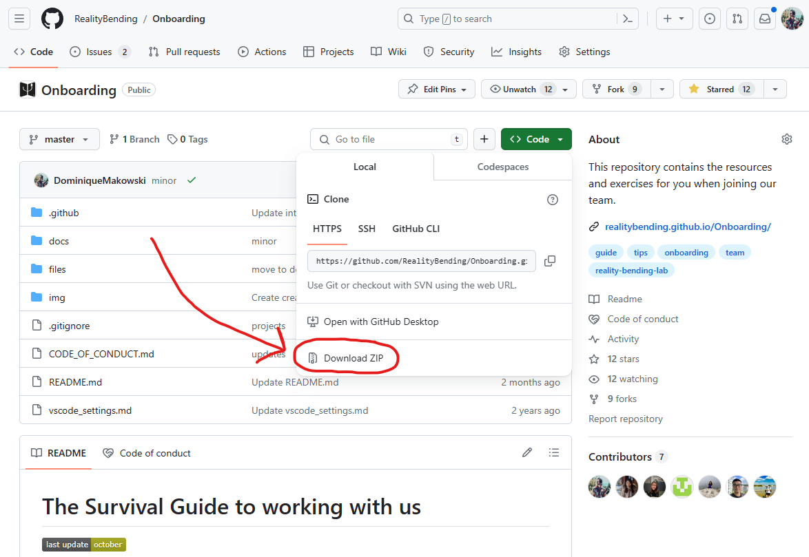

# The Survival Guide to working with us

**Welcome to the team!** 🎉 Whether you're a student, an intern or a colleague, joining a new work environment can be a bit stressful. In order to ease your first days and set you up for the future, we compiled this guide and hope that you will find it useful.

The goal of this document is first and foremost to help you acquire the **same frame of reference**, so you can then understand what we are talking about, the issues that we face and the solutions that we find. However, it is possible that some of the advice or things here might at first seem weird or useless. **Trust us though, it will *probably* become handy some day** 😉

This guide has been crafted by all **past and current members of the team**. It's our collective legacy, and it will be yours too. As such, by the end of your journey here, we hope that you will leave your mark on this document, by updating / improving / revising some of its content. Don't worry, you will see *how* to do that later.

## Our vision

<!-- Our team's ethos is centred around core values such as close **teamwork**, continuous **learning**, **friendly** environment and **aiming for new heights**. -->

We rely on a lot on internal **communication** (about stuff more *or less* related to work :grin:), on our ability to keep on learning and **improving**, on a cool **working environment** (forget the formalities, ain't nobody got time for that!), and try striving for the highest standards in terms of scientific quality and honesty. We are strongly committed to **open science**, for instance by sharing our code, documentation, data and expertise. After all, science is a collective enterprise.

On a more abstract level, we believe in what we call the **three-fold neuropsychology skillset**. In short, a neuropsychologist (and, by extension, people working on related topics) should aim (when applicable) at developing 3 types of expertise: **theoretical knowledge** (a diversified knowledge and understanding of the psychological and neuroscientific theories, frameworks and their history), **technical skills**  (statistics, programming, neuroimaging, signal processing, ...), and **clinical abilities** (knowledge about neuro/psychopathology, assessment of both patients and *healthy* participants, therapy & rehabilitation, ...). Of course, some of it (typically, working with patients) might not be feasible given the project/grade you're in. Don't worry, we will do the best we can to help you get as close as possible to your objectives.

## Work Schedule and Work-life Balance

We value and believe in individuality. Everybody has their own preferred organization and other life prerogatives. Some are night owlers and others are early birds, some have day hobbies and others night passions; some have other people to take care of (children, parents, ...) and some have themselves (which can be a lot). We should not expect each other to work regularly from 9-5 every day, or to be available at all times. **I will sometimes send emails in the evening or on the weekends**, because that's how I work. That does **not** mean you should check or reply immediately: do work when you decide to and aim for a varied lifestyle. If something is super urgent, I'll make it explicit by pre-empting the message with [URGENT] (but it never happened so far).

## Questions & Answers

> **I'm not sure what I should do and what my tasks are / I feel kinda lost**

Send us a message and let us know, we're likely unaware of that!

> **There's too much work for me** or **There's not enough work for me**

Send us a message and let us know, we're likely unaware of that!

In summary, for any reason, **do not hesitate to drop us a message!** Communication is key. Otherwise, any unaddressed issue can build up and create unnecessary stress or problems.

> **I sent a message but nobody answered...**

Don't hesitate to send us a **reminder** (after a reasonable delay). There's usually a lot going on so it happens that we miss or skip things... it's not against you. And we'll be thankful that you reminded us.

> **I don't agree with someone else**

Good, that means you're breaking out of the echo chamber. We all have a tendency to surround ourselves with people and information that validates us and our beliefs. But that's no way to improve, grow, and become a better person. University was created to challenge our current viewpoints, and expose ourselves to a realm of new possibilities. Challenge can sometimes make us feel uncomfortable, but it's okay: we are all endowed with emotion regulation abilities, communication skills, and a supporting team to rely on :)

## Reality Bending Lab

We recommend reading a few posts to better understand the lab's scope and history:

- [Rebel research themes](https://realitybending.github.io/research/)
- [REBEL logo symbolism](https://realitybending.github.io/post/2023-02-01-new_logo/)
- [What is reality bending](https://realitybending.github.io/post/2020-09-28-what_is_realitybending/)
- [Affective Reality Theory](https://realitybending.github.io/post/2023-04-11-affectivereality/)

## Get Connected

- [x] Create a profile with all of the following social networks

It might not be good news if you're an introvert who prefers to stay anonymous on the internet, but doing research at our lab will require you to build a public persona and **engage openly with the world of research**.
In general, academia is very social, and a lot of the good stuff happens on social media. Better to start little by little as soon as you can than trying to build an online presence overnight once you need to **apply for jobs** *(and yes, recruiters do Google you)*.

### 🗣️ **Discord**

We use Discord as an internal communication channel. **Do ask for the invite link** if you don't receive one.

### 🐦 **X/Twitter**

Believe it or not, but [**Twitter**](https://twitter.com/home) is super popular among academics. Many researchers use it to share and summarize their new studies and projects, recruit participants or **advertise positions**. So you can easily keep up with the latest scientific news here. There is even a [**book about Twitter for researchers**](https://t4scientists.com/).

After creating an account, you can start with your **colleagues**:

- [@RealityBending_](https://twitter.com/RealityBending_)
- [@Dom_Makowski](https://twitter.com/Dom_Makowski)

We have compiled a list of interesting accounts, covering all sorts of different topics (but always somewhat relevant to what we do). You can follow this **list** and **pin it** to quickly access it from your timeline (don't forget to make suggestions to update this list). You can then start following yourself the people that you like.

- **Reality Bending Twitter List**: https://twitter.com/i/lists/1509796111724134401

At first, you'll likely have to force yourself a bit to open and check Twitter from time to time (to make it easier, set it as a "favourite" tab and download the app). It's normal. But don't worry, once their machine learning algorithm gets a grip of what you like, it will start to be filled with interesting content.

### 👨‍🔬 **ResearchGate**

[**ResearchGate**](https://researchgate.com/home) is a professional networking site for scientists and researchers to share, discover and discuss research. (It's like a researchers' version of *LinkedIn*). You can see what kinds of projects others are currently working on, and their past manuscripts and publications. You can also **access articles**, post and answer questions, as well as recommend certain works! So do create an account and start following us and the researchers you like. I will add you to the [Lab page](https://www.researchgate.net/lab/Reality-Bending-Lab-ReBeL-Dominique-Makowski).

### :octocat: **GitHub**

The last app that we use, and probably **the most important**, is GitHub. Whether you're a beginner to programming or an expert, integrating into this community means you'll be constantly learning. GitHub is a place where projects are shared openly and transparently, and where you can follow any repository you're interested in to receive notifications of relevant updates.

- You can start by reading this post: [Why psychologists should join GitHub](https://dominiquemakowski.github.io/post/2020-05-27-github_psychologists/)

We are using GitHub for ***a lot*** of stuff (like pretty much for everything, storing data, writing papers, projects, ...), and therefore you'll need to become familiar with it. First off, let's start with:
  1. Creating an account for you (*strong advice: **use a simple login name like FirstnameSurname** rather than something you might regret later* 😬)
  2. Watch [this repo](https://github.com/neuropsychology/Onboarding) (by selecting *Watching* on the watch button in the top-right corner) (it's like "following" on Instagram)
  3. Star it 🌟 (it's like giving it a thumbs up, but it also serves as a bookmark for you, you can easily return to it)

Once you're done, let's start to interact with it by creating an issue:

  4. Create a new issue in [this repo](https://github.com/neuropsychology/Onboarding/issues)
  5. Select the **Introduce myself** template
  6. Answer the questions
  7. Post it (we'll close it afterward)

Finally, **Follow us** (hit the follow button on the top right corner):

  - [@RealityBending](https://github.com/RealityBending)
  - [@DominiqueMakowski](https://github.com/DominiqueMakowski)

## Media recommendation

### Existential Comics

Small funny reads that nicely introduce important philosophical ideas. My personal favourites (don't forget to read the little explanation at the bottom of each comic):

- [Descartes' Demon](https://existentialcomics.com/comic/81)
- [Sorry! And the Nature of Suffering](https://existentialcomics.com/comic/102)
- [What is the Sublime](https://existentialcomics.com/comic/18)
- [The Sublime and Sandwiches](https://existentialcomics.com/comic/160)
- [Mad Marx](https://existentialcomics.com/comic/186)
- [Utility Monster](https://existentialcomics.com/comic/8)
- [Fallacy Man](https://existentialcomics.com/comic/9)
- [Fallacy Man II](https://existentialcomics.com/comic/21)

Our lab hero, Captain Metaphysics, that solves every philosophical question with one simple trick:

- [Captain Metaphysics and the Ghost in the Machine](https://existentialcomics.com/comic/47)
- [Captain Metaphysics and the Mereological Monster](https://existentialcomics.com/comic/57)
- [Captain Metaphysics and the Wizard of Elea](https://existentialcomics.com/comic/82)
- [Captain Metaphysics and the Ship of Theseus](https://existentialcomics.com/comic/121)
- [Captain Metaphysics and the Extreme Skeptic](https://existentialcomics.com/comic/143)
- [Captain Metaphysics and the Postmodern Peril](https://existentialcomics.com/comic/182)
- [Captain Metaphysics and the Problem of Language](https://existentialcomics.com/comic/198)
- [Captain Metaphysics and the Swampman](https://existentialcomics.com/comic/270)
- [Captain Metaphysics and the Philosophical Zombie](https://existentialcomics.com/comic/369)

### General Neuroscience/Psychology Books

#### Emotion and Cognition

  

#### Consciousness

     

#### Clinical Neuropsychology / Psychopathology / Psychotherapy

 

### Papers

Here are some of our key papers that you can read.

#### Sense of Reality

- [Phenomenal, bodily and brain correlates of fictional reappraisal as an implicit emotion regulation strategy](https://dominiquemakowski.github.io/publication/makowski2019phenomenal/makowski2019phenomenal.pdf)
- ["Being there" and remembering it: Presence improves memory encoding](https://dominiquemakowski.github.io/publication/makowski2017being/makowski2017being.pdf)

#### Deception

- [The Structure of Deception: Validation of the Lying Profile Questionnaire](https://realitybending.github.io/publication/makowski2021structure/makowski2021structure.pdf)

#### Physio, HRV, Body-Brain Interaction

- [Heart Rate Variability in Psychology: A Review of HRV Indices and an Analysis Tutorial](https://www.researchgate.net/publication/352279590_Heart_Rate_Variability_in_Psychology_A_Review_of_HRV_Indices_and_an_Analysis_Tutorial)
- [The heart of cognitive control: Cardiac phase modulates processing speed and inhibition](https://dominiquemakowski.github.io/publication/makowski2019heart/makowski2019heart.pdf)

### Videos

- [You aren't at the mercy of your emotions -- your brain creates them | Lisa Feldman Barrett](https://www.youtube.com/watch?v=0gks6ceq4eQ)
- [Your brain hallucinates your conscious reality | Anil Seth](https://www.youtube.com/watch?v=lyu7v7nWzfo)
- ...

## GitHub

Here is a series of guidelines and exercices to help you get started with GitHub. There are multiple ways to interact with GitHub.

- GitHub is a skill with a steep learning curve (one of the steepest in my opinion). But it is absolutely worth to put the effort in (there's a reason it's one of the most popular and fastest-growing platform)
- GitHub has a confusing language: pushing, pulling, forking, cloning, committing, ...
- GitHub can be interacted with in many ways. Don't be fooled by internet comments though, we **don't need to use the console with command lines** ever. In fact, we use the amazing [**GitHub Desktop**](https://desktop.github.com/) 
- GitHub can only be mastered via trial and error, via trying to use it again and again. And once it "clicks", it becomes second nature. All you need is perseverance!
  
### Download a GitHub repository locally on your computer

You can download any repository on your computer by clicking the green button and downloading it as a **zipped** folder. Once it is saved on your computer (e.g., in the `Downloads` folder), you will need to unzip it by opening it, and dragging the content from the zip to a folder on your computer.

### **Create your own first repo**

Now, create your first repository! You can leave it mostly empty for now, it's just an experiment ground :relaxed: We recommend starting with a README page that will serve as your profile page. 
Importantly, **take some time to play around**; create repos, delete them, try to add things etc. The more time you spend getting familiar with the website the easier the next steps will be.

- **To Read**: [Creating and customizing your profile README page](https://docs.github.com/en/account-and-profile/setting-up-and-managing-your-github-profile/customizing-your-profile/managing-your-profile-readme
)

### Download GitHub Desktop

The easiest way to interact with GitHub from your computer is via [**GitHub Desktop**](https://desktop.github.com/). Download, install, and log in. 
This app essentially makes accessible your repositories as regular folder on your computer.

- Try to clone (i.e., download) a repo that you created in the previous step
- Once you have the repo on your computer, try adding a file to it (an empty text file). Then, from GitHub desktop, try to "commit" and "push" this change.
- Your new file should now also show on its online page (meaning it has successfully been "synced" between your computer's folder and the GitHub website)

### Create your first Github Pull Requests (PR)

As said earlier, **we use GitHub a lot**, so it's key that you acquire this complicated skill. However, it's quite tricky to get familiar and comfortable with it, and I'd say it's one of the most complicated things you'll have to learn. But you cannot learn if you don't try, break things and succeed.

- **Make a PR in this document here**

The first task is to create a Pull Request (PR) to modify *this very page*. Go to the [README page](https://github.com/RealityBending/Onboarding/blob/master/README.md) file and hit the "Fork and edit" button (the pen icon at the top right corner). Under the hood, this will create a fork of the Onboarding account under your repo. You can then edit the file. **Add *your* profile to the "Edited by" section at the bottom of this page**. Then, propose the change and see what happens.

- **To Read**: [markdown introduction](https://guides.github.com/activities/hello-world/)

### Setting up your profile on the REBEL website

The next task is to set-up your profile on the [lab website](https://realitybending.github.io/people/).

- **Step 1: Fork the website repository**
    - Go to the [Github Repository of website](https://github.com/RealityBending/RealityBending.github.io)
    - Hit the **fork** button at the top right corner to make a *copy* of the repository in your Github account.
    - After a few minutes of waiting, you should now see a repository with a name of `your-username/RealityBending.github.io`.

- **Step 2: Understand how a profile is made**
    - In your newly *copied* repository, navigate to the folder `your-username/RealityBending.github.io/content`. This is where all the content of the website is stored.
    - Click on the `authors` folder. As you can see, each member has a folder (in lower case with a hyphen instead of spaces).
    - Explore one of these folder, for instance Gandalf's. It includes two files, *_index.md* file (The extension *.md* stands for **markdown**) and an image file named `avatar`.
    - Click on the .md file, and then on the **raw** button (on the right) to see the raw file (as a notepad would see).
    - The index file contains all the information, and is organized into a YAML header (delimited by 3 dashes ---) and then some text.

- **Step 3: Add your profile to the website**

    - Now that you understood how a profile is made, create on your computer a folder named `firstname-surname` (replace accordingly).
    - In this folder, put your profile pic and name it `avatar`.
    - Create a new text file named `_index` and replace the extension so that it's `.md` instead of `.txt` (google how to see file extensions if you're on windows and don't have it activated).
    - Open it with any raw text editor like notebook or RStudio or VScode (but not Word!).
    - Replace the text for something that applies to you.

- **Step 4: Commit to your fork**

    - On the `your-username/RealityBending.github.io/contentauthors/` page, you should click on **Add file** (on the right) and then **Upload files**.
    - Drag and drop your folder and click **"commit"**. You can add a commit message such as "Added my profile"/
    - You should see the folder that you just created at `https://github.com/your-username/RealityBending.github.io/tree/main/content/authors/MY-NEW-FOLDER`

- **Step 5: Make a Pull Request**

    - Great, you added the files to your own copy of the website. But now we need to merge these changes into the **original** repository.
    - Look for the *Pull Rquest* sign. Click on it.
    - The page will show that you are trying to make a Pull Request from **your** repository *"your-username/RealityBending.github.io"* to the **original** repository *RealityBending/RealityBending.github.io"*.
    - All the left for you to do is to click on that shiny green button to create the pull request (PR). Your profile will appear on the website as soon as an administrator validates the PR.

Congratulations! You have successfully updated your profile on our website!

Note that on GitHub (but also when writing research articles), we write in **markdown**, which is a set of conventions allowing to quickly and easily format text (e.g., text in bold, italic, titles, etc.).

- [**To read: markdown introduction**](https://guides.github.com/features/mastering-markdown/)

Further reading.

- [How to use Github to contribue](https://neurokit2.readthedocs.io/en/latest/contributing/contributing.html#how-to-use-github-to-contribute)
- [How to create a Pull Request](https://www.earthdatascience.org/courses/intro-to-earth-data-science/git-github/github-collaboration/how-to-submit-pull-requests-on-github/)
- [Github Cheatsheet](https://github.com/tiimgreen/github-cheat-sheet)

## Python

We mostly use Python for signal processing and setting up experimental tasks. For instance, the [NeuroKit2](https://github.com/neuropsychology/NeuroKit) project that we are working on is written in Python.
We also build our experimental tasks using [Neuropsydia.py](https://github.com/neuropsychology/Neuropsydia.py) which is also a Python module.

Therefore, it's important that you get familiar with the tool. Following are a few resources that we suggest to get you started:

- [Get familiar with Python in 10 minutes](https://neurokit2.readthedocs.io/en/latest/start/learn_python.html)

### Setting-up Python

1. Download [VS Code](https://code.visualstudio.com/download) (or if you already have Winpython installed, simply open `VS Code.exe` from the winpy folder)
2. Download [Python](https://www.python.org/downloads/)
3. Once VS Code is launched, the next step is to add new features and functionalities to support your development workflow. You can do so by installing these [extension packages](https://github.com/RealityBending/Onboarding/blob/master/vscode_settings.md#extensions) which you can find by clicking on this icon in the activity bar:

4. Configure your workspace settings, using the following command: `Ctrl+Shift+P` and click on *Preferences: Open Settings (JSON)*. This opens your user `settings.json` where [the following configuration](https://github.com/RealityBending/Onboarding/blob/master/vscode_settings.md#settings) should be copied and pasted to (take note of the key path directories you will need to modify according to your machine!)
5. To start running some code, click *New File* and `Ctrl+S` to save the file into whichever directory in your computer you want, naming the file with a `.py` extension. Press `Shift+Enter` to send each line of code to an interactive window

## R

The bulk of our statistical analyses and manuscript preparation is done on R.

At this point, you might ask why can't we just stick to one programming language? What is the point of learning both R and Python?
The simple answer is that the two programming languages are basically different, and one can be better depending on the task.
Read this [**blog post** *(R or Python for Psychologists)*](https://dominiquemakowski.github.io/post/r_or_python/) for a more in-depth discussion.

Following are a few resources to get you started with R:

- [**Introduction to R**](http://www.r-tutor.com/r-introduction)
- **Help us!** Know some good ressources that helped you! Please share it with us

# Some Final Words

We encourage you to explore and be integrated within the online scientific community along with us, as this will help you expand your knowledge and skillset as well as become better informed! It may be a steep learning curve initially, but we're here to help you along the way (we've been there ourselves!) and never hesitate to ask questions 😉

# Edited by

- [Jingxiong Xu](https://github.com/JingxiongXu)
- [Zen Juen](https://github.com/zen-juen)
- [Tam Pham](https://github.com/Tam-Pham)
- [Catriona Osborn Moar](https://github.com/CatrionaOM)
- [DominiqueMakowski](https://github.com/DominiqueMakowski)
- Faris Al-kadi (https://github.com/Faris316)

